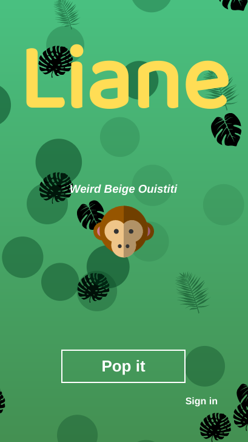
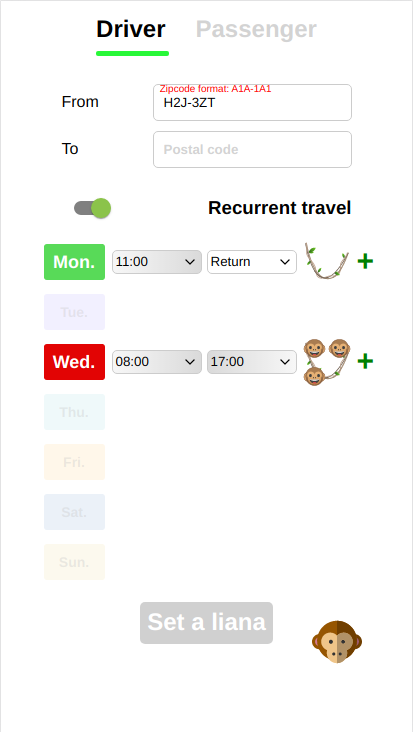
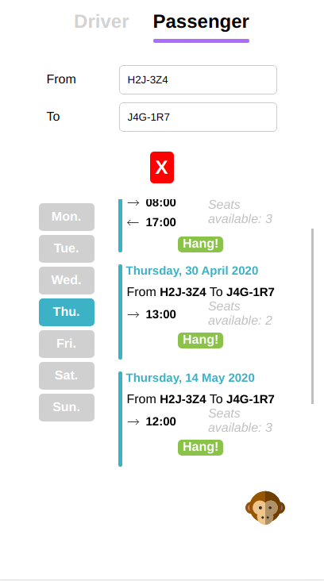
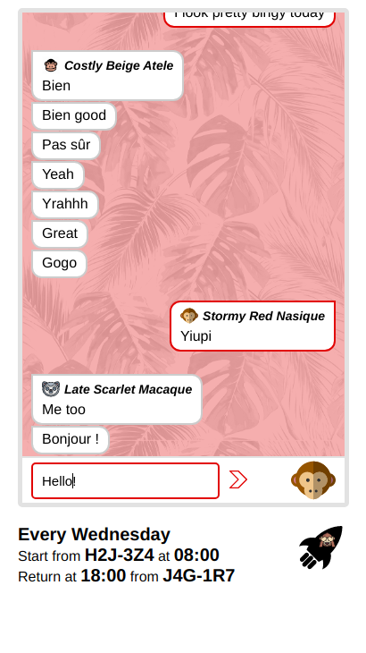
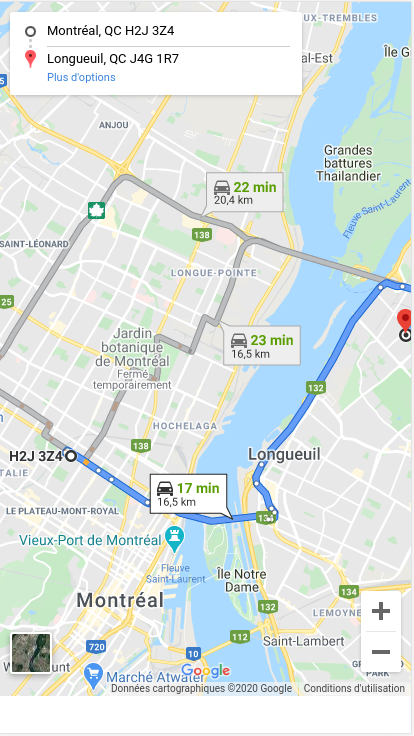
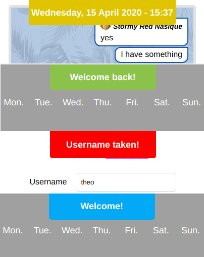

# Preview

### Select a unique avatar


### Set a travel 


### Find travels


### Organized day to day dashboard


### Chat


### Navigate


### Custom notifications


### Region zip formatting validation


# Main Librairies 
- React 16
- Redux
- Express
- Mongodb
- Node
- Particles JS

# Install project

node version >= 10

`npm install`

`vi config.js`

```js
module.exports = {
  url: "mongourl",
  map_API_KEY: "GOOGLE_API_KEY"
}
```

`npm install`

`npm start`

http://localhost:4000

# Features coming

See [TODO](doc/Todo.md)